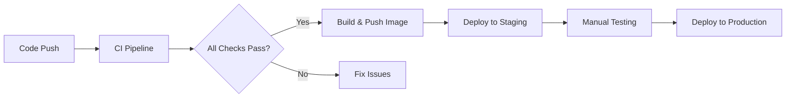

# 🚀 CI/CD Pipeline Documentation

## Overview

Pipeline CI/CD ini menggunakan **GitHub Actions** untuk automated testing, security scanning, building, dan deployment dari microservice banking.

## 📁 File Structure

```
.github/
└── workflows/
    ├── ci.yml      # Continuous Integration pipeline
    └── deploy.yml  # Continuous Deployment pipeline
```

## 🔄 CI Pipeline (`ci.yml`)

### Triggers

- **Push** ke branch `main` atau `develop`
- **Pull Request** ke branch `main`

### Jobs Overview

#### 1. **Test Job**

- **Environment**: Ubuntu Latest dengan PostgreSQL 15
- **Database**: Automatic PostgreSQL service container
- **Steps**:
  - ✅ Setup Go 1.21
  - ✅ Cache Go modules untuk faster builds
  - ✅ Install golang-migrate
  - ✅ Run database migrations
  - ✅ Generate SQLC code
  - ✅ Run unit tests dengan coverage
  - ✅ Run race condition tests

#### 2. **Lint Job**

- **Tools**: golangci-lint dengan 30+ linters
- **Check**: Code quality, style, potential bugs
- **Config**: `.golangci.yml`

#### 3. **Security Job**

- **Gosec**: Security vulnerability scanner
- **Nancy**: Dependency vulnerability scanner
- **SAST**: Static Application Security Testing

#### 4. **Build Job**

- **Dependency**: Runs after test, lint, security pass
- **Output**: Linux binary artifact
- **Optimization**: CGO disabled untuk static binary

## 🚢 CD Pipeline (`deploy.yml`)

### Triggers

- **Release**: Published release pada GitHub
- **Manual**: Workflow dispatch dengan environment selection

### Features

- **Multi-platform**: Build untuk linux/amd64 dan linux/arm64
- **Container Registry**: GitHub Container Registry (ghcr.io)
- **Environments**: Staging dan Production
- **Docker Layer Caching**: Faster subsequent builds

## 🐳 Docker Configuration

### Dockerfile Features

- **Multi-stage build**: Separate build dan runtime
- **Minimal image**: Alpine Linux untuk small footprint
- **Security**: Non-root user execution
- **Health check**: Built-in health monitoring
- **Static binary**: No external dependencies

### Image Size Optimization

```dockerfile
# Build stage: golang:1.21-alpine (~300MB)
# Runtime stage: alpine:latest (~5MB)
# Final image: ~15MB (excluding your app)
```

## 🛠️ Local Development

### Prerequisites

```bash
# Install tools
go install github.com/sqlc-dev/sqlc/cmd/sqlc@latest
go install github.com/golang-migrate/migrate/v4/cmd/migrate@latest
curl -sSfL https://raw.githubusercontent.com/golangci/golangci-lint/master/install.sh | sh -s -- -b $(go env GOPATH)/bin v1.54.2
```

### Quick Commands

```bash
# Setup database
make postgres
make createdb
make migrateup

# Development cycle
make sqlc          # Generate code
make test          # Run tests
make lint          # Check code quality
make security      # Security scan
make build         # Build binary

# All checks (CI simulation)
make ci
```

## 🔐 Security Features

### SAST (Static Application Security Testing)

- **Gosec**: Go-specific security analyzer
- **golangci-lint**: Multiple security linters
- **Nancy**: Dependency vulnerability scanning

### Container Security

- **Non-root user**: Runtime security
- **Minimal image**: Reduced attack surface
- **Health checks**: Service monitoring
- **Multi-stage build**: Clean final image

### Secrets Management

- Environment variables untuk sensitive data
- GitHub Secrets untuk CI/CD credentials
- No hardcoded secrets di code

## 📊 Monitoring & Observability

### Health Checks

```bash
# Docker health check
wget --no-verbose --tries=1 --spider http://localhost:8080/health
```

### Logging

- Structured logging dengan levels
- Request tracing dengan context
- Performance metrics

## 🎯 Best Practices Implemented

### Code Quality

- **Test Coverage**: Unit tests dengan coverage reporting
- **Race Detection**: Concurrent access testing
- **Linting**: 30+ code quality checks
- **Security**: SAST dan dependency scanning

### DevOps

- **Infrastructure as Code**: All configs dalam repository
- **Reproducible Builds**: Locked dependencies dan versions
- **Artifact Management**: Container registry storage
- **Environment Promotion**: Staging → Production flow

### Security

- **Zero Trust**: Security checks di setiap step
- **Principle of Least Privilege**: Non-root containers
- **Supply Chain Security**: Dependency vulnerability scanning
- **Secrets Management**: External secret storage

## 🚀 Deployment Strategy

### Environments

1. **Development**: Local development dengan hot reload
2. **Staging**: Mirror dari production untuk testing
3. **Production**: Live environment dengan monitoring

### Release Process



## 📈 Metrics & KPIs

### CI/CD Performance

- **Build Time**: Target < 5 minutes
- **Test Coverage**: Target > 80%
- **Security Issues**: Target = 0
- **Deployment Frequency**: Multiple per day

### Quality Gates

- ✅ All tests must pass
- ✅ No security vulnerabilities
- ✅ Code coverage > threshold
- ✅ No linting errors
- ✅ Successful build artifact

## 🔧 Troubleshooting

### Common Issues

1. **Test Failures**: Check database connection dan migrations
2. **Lint Errors**: Run `make lint` locally first
3. **Security Issues**: Review gosec output dan dependencies
4. **Build Failures**: Verify Go modules dan dependencies

### Debug Tips

```bash
# Local testing
make ci                    # Run full CI locally
docker build -t test .     # Test Docker build
docker run --rm test       # Test container run
```

## 📚 Further Reading

- [GitHub Actions Documentation](https://docs.github.com/en/actions)
- [Go Testing Best Practices](https://golang.org/doc/tutorial/add-a-test)
- [Docker Multi-stage Builds](https://docs.docker.com/develop/dev-best-practices/dockerfile_best-practices/)
- [golangci-lint Linters](https://golangci-lint.run/usage/linters/)
